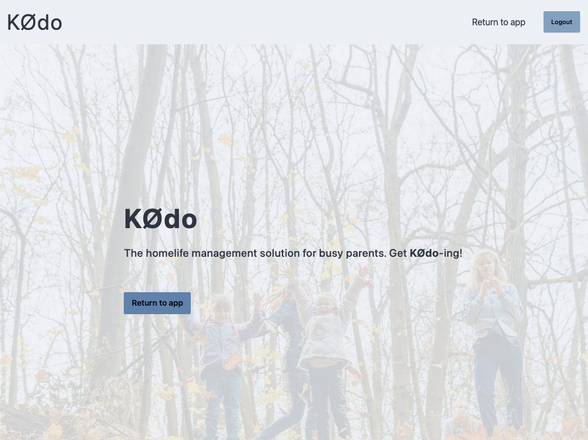
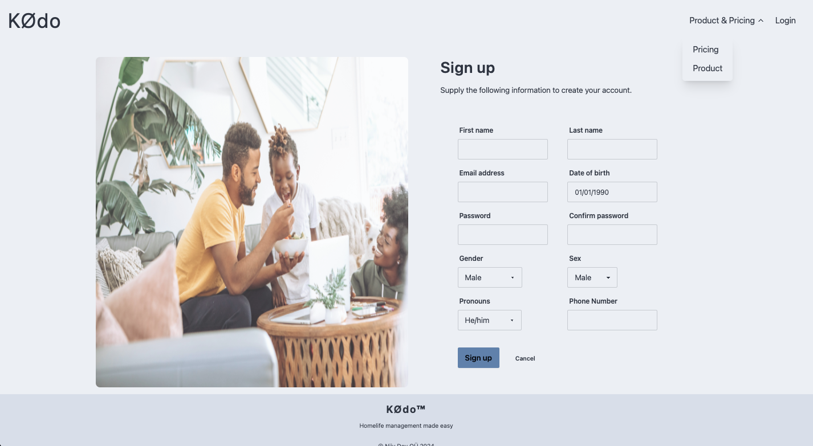
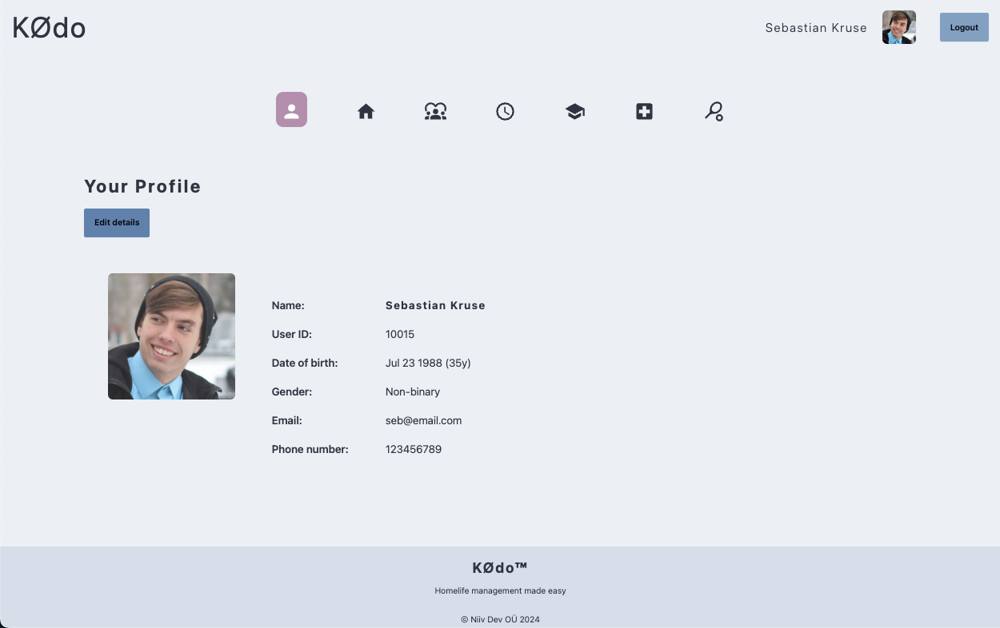
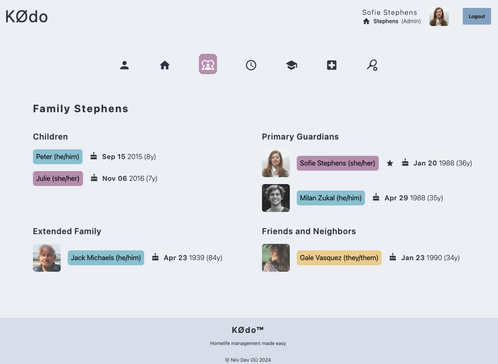

# KØdo (Niamh Doyle MVP)

## What

Fullstack MVP project using React, React Router, Tailwind CSS, Daisy UI and Material Icons in the frontend and Express and MySQL in backend.

## Presentation deck

[Link to deck](https://drive.google.com/file/d/1qy2mz3wCinoqPoAeg17vlnhMZVn-DJ1Z/view?usp=sharing)

## Concept

KØdo (from Estonian kodu 'home' + English 'do') is pitched as a homelife management solution for busy parents, to facilitate caring for their children via the sharing of important information on the children in the family between guardians, be they primary guardians, extended family guardians (such as grandparents), or temporary guardians (e.g. neighbours, friends).

The idea is for it to be a convenient tool to allow for scheduling of family life and storing of key data points, such as contact information of the children's schools and doctors, child dietary requirements and likes, upcoming appointments and events etc.

## Functionality

### Present functionality

- Sign up as a new user
- Create a family as an admin user
- Edit profile details
- Add children and invite other users guardians to your family
- Send, cancel and accept / decline invites
- Remove guardians
- View family's doctors and teachers (data comes only from backend starter data)

### Not presently-possible functionality (but possible to do)

- Provide other guardians access to only speciifc views
- Edit child details
- Add information on your child's school, teacher, doctor, diet, etc.
- Scheduling
- Sending reminders by SMS/email/WhatsApp

## Pages

### Homepage & login

Homepage as seen by logged-out visitors

Homepage as seen by logged-in users

;

Login screen

;

Sign up

;

### Inner App

The inner app, which a user gets access to upon successful sign in. Allows user to navigate to a number of views. Only the profile, admin, and family views have been built out so far.

#### Profile

#### Admin view

#### Family view

#### Schooling view

#### Health view

## Features

### Invites

Invite banner notification as seen from the invitor's side

Invite banner notification as seen from the invitee's side

## Backend

### ERD

### Endpoints

7 endpoints – /users, /families, families/members, /children, /invitations, /health, /education

## Conceptualising

_This is a student project that was created at [CodeOp](http://codeop.tech), a full stack development bootcamp in Barcelona._
